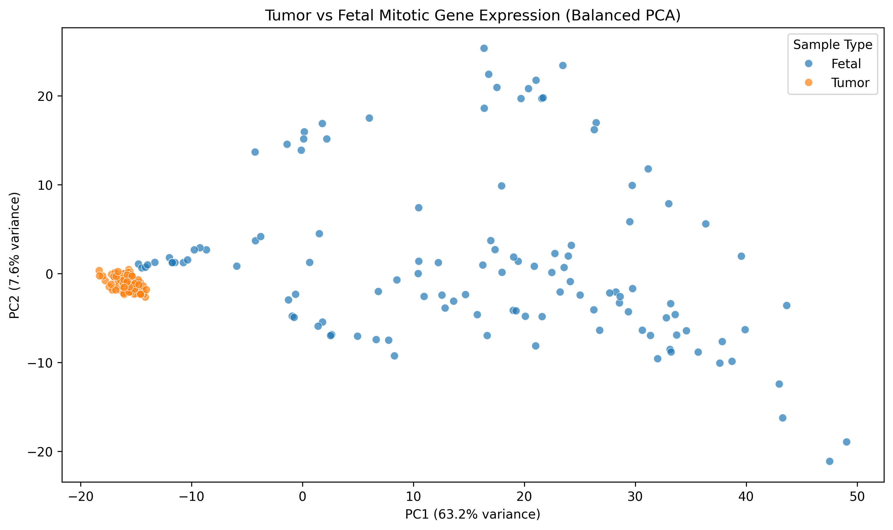

## 🧬 Cancer–Development Transcriptomics

**Do Tumors Recapitulate Fetal Mitotic Gene Expression Programs?**

### Overview

This project investigates whether tumor gene expression patterns resemble those of fetal tissue, focusing on mitotic gene programs using RNA-seq data from TCGA and fetal expression datasets.

---

### Research Question

Do tumors exhibit mitotic gene expression profiles similar to those observed during fetal development?

---

### Approach

- Gene-level RNA-seq TPM data (TCGA tumors + fetal samples)
- Curated set of ~600 mitotic genes
- Alignment of shared genes across datasets
- PCA for dimensionality reduction and comparison
- Controlled sampling to correct for dataset imbalance

---

### Key Result

After balancing sample sizes, tumor samples form a tight cluster within a limited region of gene expression space, while fetal samples span a much broader range.

---

### Interpretation

Tumor mitotic gene expression appears highly constrained and uniform, whereas fetal mitotic expression is diverse and context-dependent across tissues and developmental stages.

This suggests that tumor proliferation may reflect a restricted subset of developmental programs, rather than broadly recapitulating fetal gene expression patterns.

---

### Limitations

- Analysis restricted to mitotic genes
- No direct inclusion of normal adult tissue for comparison
- PCA provides a global view but does not capture all transcriptional relationships

---

### Project Structure

notebooks/ → main analysis notebook
data/ → fetal + TCGA processed data
results/ → figures and output tables

---

### Status

This is an exploratory analysis intended to refine hypotheses about the relationship between cancer and developmental gene expression.
