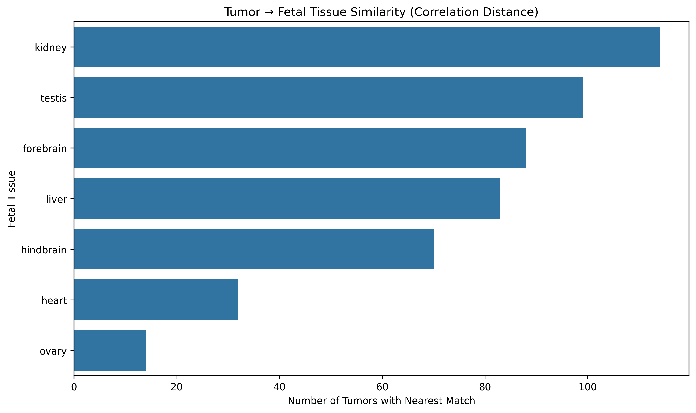
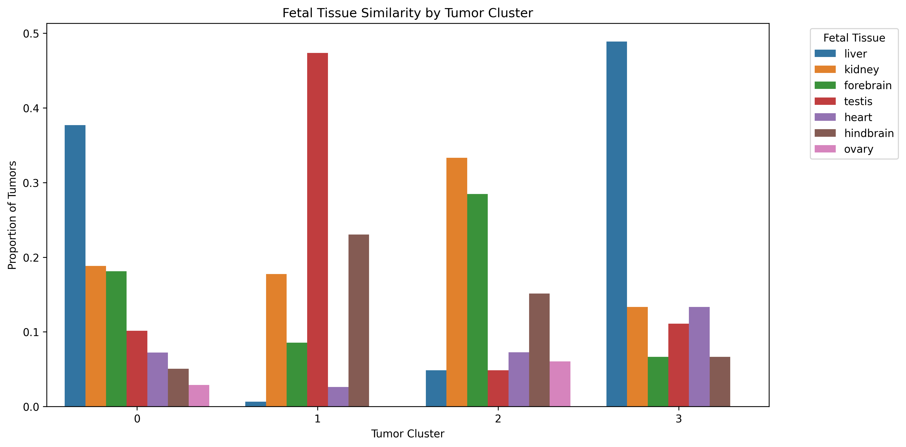

## Cancer–Development Transcriptomics

**Do Tumors Reuse Fetal Gene Expression Programs?**

---

### Overview

Cancer cells divide rapidly. So do cells in early development.

This project asks a simple question:

> **Do tumors “look like” fetal tissue at the gene expression level?**

To test this, we compare tumor and fetal RNA-seq data, focusing on genes involved in cell division (mitosis).

---

### Research Question

Do tumors exhibit gene expression patterns similar to those seen during fetal development?

---

### Approach (Plain Language)

- Start with real RNA-seq data from tumors (TCGA) and fetal tissues
- Focus on ~600 genes involved in cell division
- Keep only genes shared between both datasets
- Compare tumor and fetal samples in two ways:
  1. **PCA** → do they occupy similar regions overall?
  2. **Pattern matching** → which fetal tissues do tumors most resemble?

---

### Key Result 1: Global Structure (PCA)

After correcting for sample size differences, tumor samples cluster tightly in a small region, while fetal samples spread across a much wider space.

**Interpretation:**  
Tumors occupy a narrow and consistent expression state, while fetal development explores many different states.

---

### Key Result 2: Tissue-Level Similarity

When comparing expression patterns directly, tumors most often resemble:

- kidney
- testis
- liver
- brain regions

**Interpretation:**  
Tumors do not match one specific fetal tissue. Instead, they resemble multiple highly active developmental contexts.

---

### Key Result 3: Tumor Subgroups

Clustering tumors reveals distinct groups with different fetal tissue similarities.

Some clusters are enriched for:

- liver/kidney-like patterns
- testis-like patterns
- neural-like patterns

**Interpretation:**  
Tumors are not a single state. They form **subtypes**, each resembling different developmental programs.

---

### Overall Interpretation

- Tumor gene expression is **consistent but limited**
- Fetal gene expression is **diverse and context-dependent**
- Tumors do not fully “revert” to fetal states
- Instead, they reuse **specific subsets of developmental programs**

---

### Limitations

- Focused only on mitotic (cell division) genes
- No direct comparison to normal adult tissue
- Results depend on chosen similarity metric (correlation distance)
- PCA captures global structure but not all relationships

---

### Project Structure

notebooks/ → analysis notebook
data/ → processed tumor + fetal data
results/ → figures and tables

---

### Status

This is an exploratory analysis aimed at understanding how cancer relates to developmental biology.

**Note:** Raw TCGA files are not included due to size constraints. The project is reconstructed from processed UCSC Xena TPM data.
